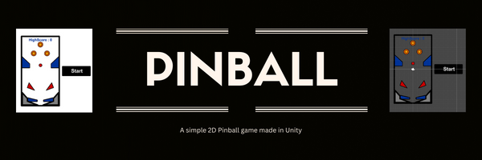

# PINBALL

- Tvorba počítačové hry

### 1. Základní koncepce

- Pujde o klasický PinBall 2D, s pohledem shora. Hra je tvořena v GE Unity.

### 2. Level design

- K ovládání bude uživatel používat 2 flippery. 

### 3. Grafika

- Jednotlivé objekty jsou tvořeny přímo v GE Unity a poté je k nim přidávána grafika

### 4. Zvuky (Audacity)

- Část zvuků bude tvořena syntezou a zbylou část bude využita Unity knihovna

### 5. Hudba (LMMS)

- Neni ještě jisté zda bude mít hra nějaké barevné podbarvení.

### 6. Unity

- Unity je výkonný engine ve kterém se dá dělat téměř cokoliv, proto PinBall nebude nijak náročný. 

### 7. Propagace (video, bannery…)

### 8. Finální hra

- Seznamte kompletně čtenáře s poslední verzí své hry. Screenshoty, zvuky, videonahrávka z akce…

### 9. Závěr

- Na konci svého projektu zkuste zhodnotit svou práci. Sdělte čtenáři největší úskalí, a jak jste je řešili.
